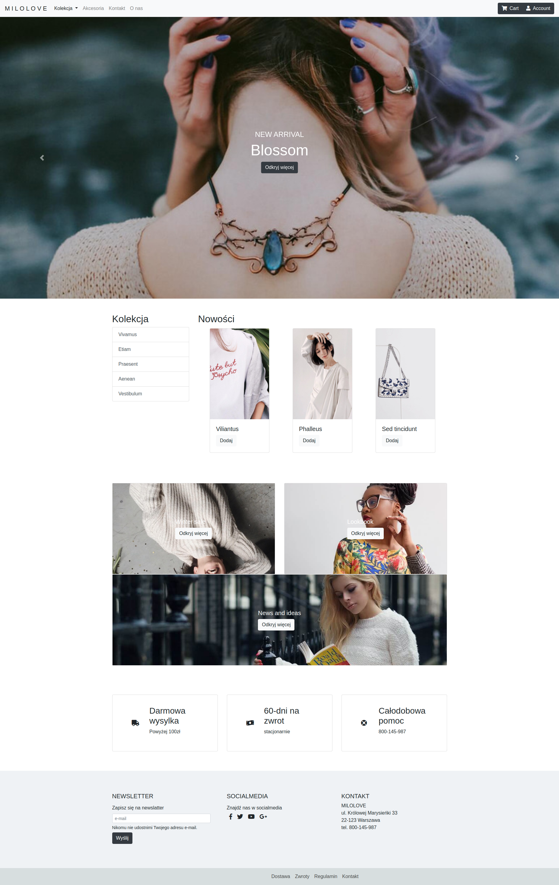

# 🛒 "MILOLOVE": A Responsive E-commerce Homepage
"MILOLOVE" is a modern, responsive homepage designed for an online shop, created using the Bootstrap 4 framework. This project is centered around RWD (Responsive Web Design) principles, ensuring the site is flexible and user-friendly on any device. The design leverages Bootstrap's grid system, along with Flexbox and custom SCSS, to provide a clean and organized layout.

[](https://ollawilk.github.io/bootstrap-home-page-shop/)
###### Images used in project are from rawpixel.com 

**[Click here to view the live site](https://ollawilk.github.io/bootstrap-home-page-shop/)**

## 🚀 Technologies


## ⭐ Key Features:

### 1. Responsive Design:

- **Mobile-Optimized:** The site adapts to various screen sizes, ensuring a seamless user experience on desktops, tablets, and mobile devices.

- **Bootstrap Grid System:** Utilizes Bootstrap's grid system to create a flexible layout, dividing the content into responsive columns.

- **Flexbox Integration:** Flexbox is used for structuring layout elements, making it easy to manage alignment, spacing, and distribution.

### 2. User-Friendly Interface:

- **Interactive Navbar:** Features a responsive navigation bar with dropdowns, which collapses into a mobile-friendly "hamburger" menu on smaller screens.

- **Carousel for Featured Products:** A dynamic carousel showcases featured products, allowing for visual storytelling through sliding images and captions.

- **Custom Cards:** Product listings and other sections are displayed using Bootstrap's card component, providing a consistent and clean design.

### 3. Modern Web Development:

- **SCSS for Advanced Styling:** SCSS is used to organize styles efficiently, employing variables, mixins, and nested rules for easier management.

- **Bootstrap Customization:** The Bootstrap framework is customized to suit the specific needs of this project, demonstrating the flexibility of the framework.

- **Semantic HTML5:** The use of semantic HTML5 elements improves accessibility and SEO, making the site more meaningful for search engines and assistive technologies.

### 4. Enhanced User Experience:

- **Responsive Utilities:** Bootstrap's utility classes are employed to handle spacing, alignment, and visibility across different screen sizes without the need for custom CSS.

- **Responsive Media Queries:** Media queries ensure that the layout adapts smoothly to different devices, providing a consistent user experience.


## :panda_face: Installation and Launch

The website does not require installation. To view the homepage, simply open the index.html file in a web browser. Alternatively, you can host the project on a web server to make it accessible online.

For a more advanced setup, follow these steps:

**Clone the project:**

 ```bash
git clone https://github.com/OllaWilk/bootstrap-home-page-shop.git
```

**Go to the project directory:**

 ```bash
cd bootstrap-home-page-shop
```

**Install dependencies:**

 ```bash
npm install
```

**Start the server:**

 ```bash
npm run watch
```

## 🤓 Summary 
Creating the "MILOLOVE" homepage using Bootstrap 4 was a great way to deepen my understanding of both the framework and responsive design. Throughout the project, I learned how to effectively use Bootstrap’s grid system, components, and utilities to quickly build a professional-looking, responsive website. I also gained valuable experience in customizing Bootstrap with SCSS to better fit the specific needs of the project, which really helped improve my front-end development skills.

One of the biggest challenges I faced was learning how to navigate and make the most out of Bootstrap's documentation, especially since it was my first time doing so. This experience made me realize how important it is to fully understand the tools and resources a framework offers. Being able to modify and extend these tools is crucial for creating unique and functional web designs.

This project also highlighted the importance of grasping the core principles behind frameworks like Bootstrap. While these tools are great for speeding up development, knowing how to dig into their documentation, tweak, and extend them is key to building custom, high-quality websites.


